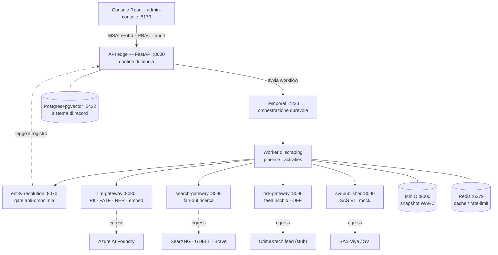
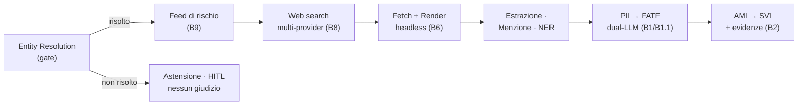

# Architettura e funzionalità — documento tecnico (as-built)

Adverse Media Screening · pilota **FSC / MASE** · aggiornato: 2026-09-08

Documento tecnico **as-built**: descrive le funzionalità tecniche e di business
dell'applicazione a partire dal codice attuale — architettura complessiva, stack,
descrizione di ogni microservizio, fonti dati, ruoli, gate anti-omonimia e
scoring. Complementa la baseline funzionale
[`WebScraping_AdverseMedia_FSC_MASE.1.0.md`](WebScraping_AdverseMedia_FSC_MASE.1.0.md)
e il documento di deployment
[`DEPLOYMENT_E_INTEGRAZIONE_SAS.md`](DEPLOYMENT_E_INTEGRAZIONE_SAS.md).

## Indice

1. [Sintesi di business](#1-sintesi-di-business)
2. [Architettura complessiva](#2-architettura-complessiva)
3. [Flusso di screening](#3-flusso-di-screening)
4. [Microservizi](#4-microservizi)
5. [Infrastruttura](#5-infrastruttura)
6. [Fonti dati](#6-fonti-dati)
7. [Ruoli](#7-ruoli)
8. [Anti-omonimia](#8-anti-omonimia)
9. [Classificazione e AMI](#9-classificazione-e-ami)
10. [Compliance e governance](#10-compliance-e-governance)
11. [Stack tecnologico](#11-stack-tecnologico)

---

## 1. Sintesi di business

Il sistema automatizza la **ricerca di notizie negative** (adverse media) sui
soggetti di un intervento FSC — beneficiari, soggetti attuatori, imprese
esecutrici e relativi ruoli apicali (RUP, legale rappresentante, amministratore)
— e produce, per ciascun soggetto, un **alert motivato** con punteggio di
rilevanza (AMI), categorie di rischio FATF ed **evidenze tracciabili** (URL, hash
del contenuto, snapshot). Obiettivo: **orientare l'istruttoria desk di I livello**
(Si.Ge.Co. / SIM), non sostituirla.

**Principi di progetto**

- **Compliant by design** — base giuridica per i dati giudiziari (art. 10 GDPR),
  DPIA + FRIA (art. 27 AI Act), Human-in-the-loop, audit trail; **nessuna
  decisione automatizzata**.
- **Anti-omonimia obbligatoria** — un gate di Entity Resolution risolve l'identità
  (CF/P.IVA/CUP) *prima* di qualunque giudizio: senza identità certa, si sospende.
- **Materialità** — ogni alert è ancorato allo specifico intervento (CUP/CIG) e al
  ruolo del soggetto.
- **Explainability** — ogni punteggio è spiegato da *driver* leggibili (categorie,
  credibilità della fonte, corroborazione, motivazione).
- **Sinergia, non duplicazione** — complementare ad ARACHNE / PIAF: aggiunge il
  segnale "notizie negative" alle fonti strutturate.

> **Confine di responsabilità.** Il sistema è **decision-support**: assegna
> priorità e fornisce evidenze. La determinazione resta all'istruttore umano. Gli
> alert ad alto rischio vengono *escalati*, mai chiusi o aperti automaticamente
> con effetti sul beneficiario.

---

## 2. Architettura complessiva

Architettura a **microservizi** su Docker Compose. La console React non parla mai
direttamente con dati, coda o servizi esterni: l'**API edge (FastAPI)** è
l'**unico confine di fiducia** (autenticazione MSAL/Entra, RBAC, audit).
L'orchestrazione è affidata a **Temporal** (workflow durevole, idempotente). Ogni
**egress esterno** (Azure, motori di ricerca, Crime&tech, SAS Viya) passa da un
**gateway dedicato**: un unico punto in cui concentrare auth, rate-limit,
redazione PII e mappatura verso il dominio.



**Pattern chiave:** confine di fiducia unico (API) e *gateway-chokepoint* per ogni
egress. `entity-resolution` non esce sulla rete (legge il registro dai dati via
API); `risk-gateway` è **disattivo di default** e `svi-publisher` gira in **mock**
in locale. Postgres è il sistema di record; MinIO conserva gli snapshot immutabili
(WARC).

---

## 3. Flusso di screening

Un workflow Temporal orchestra la sequenza. Il **gate di Entity Resolution è il
primo passo**: se l'identità non è risolta, il flusso si interrompe con un esito
"da disambiguare" (astensione), senza produrre alcun giudizio adverse-media.



Selezione degli URL in tre modi (in ordine di precedenza): **URL singolo**
(override manuale) → **articoli scelti** in console → **ricerca automatica**. La
menzione del soggetto è verificata **prima** della redazione PII, così il
mascheramento non rompe il match. La redazione avviene al chokepoint `llm-gateway`
prima dell'egress verso Azure.

**I passi in sintesi**

| # | Stadio | Cosa fa |
|---|--------|---------|
| 1 | **Entity Resolution** (gate) | Risoluzione dell'identità contro il registro; se ambigua/irrisolta → astensione. |
| 2 | **Feed di rischio** (B9, opz.) | Indicatori AML/CFT + connessioni sul soggetto risolto. |
| 3 | **Web search** (B8) | Fan-out su più motori, merge/dedup per URL, boost di corroborazione. |
| 4 | **Fetch + Render** (B6) | Fetch conforme (robots/crawl-delay), snapshot WARC su MinIO, fallback headless Playwright per pagine JS. |
| 5 | **Estrazione + Menzione + NER** | Testo (trafilatura), verifica che il soggetto sia citato, corroborazione anagrafica e NER. |
| 6 | **PII → FATF** (B1/B1.1) | Redazione PII e pseudonimizzazione nomi, poi classificazione FATF dual-LLM. |
| 7 | **AMI → SVI** (B2) | Punteggio pesato, pubblicazione dell'alert con evidenze, persistenza. |

Esito: alert motivato con AMI, categorie FATF, driver ed evidenze tracciabili.
Disposition possibili: `AUTO_CHIUSO`, `ESCALATION_I_LIVELLO`,
`HITL_ENTITY_RESOLUTION`.

---

## 4. Microservizi

Ogni servizio è isolato, con la propria immagine e configurazione. I gateway
concentrano l'egress esterno; il worker esegue la logica di pipeline; l'API è
l'unico confine verso la console.

### admin-console — React · Vite · `:5173`
**Front-end di amministrazione.** Console operativa dell'istruttore/amministratore:
avvio screening, gestione del *registro soggetti* (anti-omonimia, con controllo
live CF ↔ anagrafica), catalogo fonti e stato dei motori di ricerca, consultazione
degli alert con evidenze, observability.
*Tecnologia:* React + TypeScript + Vite, Material UI; auth MSAL/Entra
(disattivabile in dev). Parla *solo* con l'API.
*Pagine:* `Screening` · `Soggetti` · `Sources` · `Alerts` · `Observability`.

### api — FastAPI · `:8000`
**Back-end edge · confine di fiducia.** Unico punto di ingresso: autentica
(Entra/JWT), autorizza (RBAC), valida, scrive l'*audit*. Avvia i workflow su
Temporal, espone registro soggetti, fonti, screening, alert e anteprima di
ricerca. È il **sistema di record** (Postgres) per alert ed evidenze.
*Tecnologia:* FastAPI, SQLAlchemy async + Alembic, Postgres (pgvector).
*Endpoint:* `POST /api/screening` · `GET /api/subjects` ·
`POST /api/subjects/import` · `GET /api/alerts` · `POST /api/search/preview` ·
`GET /api/search/providers` · `GET /api/sources`.

### worker-scraping — Temporal
**Pipeline di screening.** Esegue la pipeline come *activities* idempotenti
orchestrate dal workflow durevole. Contiene la logica di dominio (fetcher
conforme, snapshot WARC, corroborazione, AMI).
*Tecnologia:* Python, temporalio; httpx, trafilatura, Playwright/Chromium,
boto3/warcio (MinIO). Moduli: `fetcher` `render` `extract` `mention`
`anagraphics` `classifier` `snapshot`.
*Activities:* `resolve_entity` · `assess_risk_feed` · `search_articles` ·
`fetch_source` · `render_source` · `verify_subject_mention` · `classify_fatf` ·
`compute_ami` · `publish_svi` · `persist_alert`.

### entity-resolution — FastAPI · `:8070`
**Gate anti-omonimia.** Risolve il soggetto contro il registro: match
deterministico su CF/P.IVA, coerenza CF ↔ dati anagrafici (decode del Codice
Fiscale), disambiguazione probabilistica su nome con restringimento per
data/luogo di nascita e per **CUP** dell'intervento; blending opzionale con
embedding semantici. Restituisce stato + metodo + confidenza + warning.
*Tecnologia:* FastAPI; logica CF pura; embedding via llm-gateway. Legge il
registro dall'API (nessun egress esterno).
*Endpoint:* `POST /resolve` · `POST /cf-check` · `GET /validate`.

### llm-gateway — FastAPI · `:8080`
**Chokepoint verso Azure AI Foundry.** Unico punto di uscita verso l'LLM.
**Redige le PII** prima dell'invio (B1: CF, P.IVA, email, IBAN, telefoni; B1.1:
pseudonimizzazione dei nomi via NER → `[SOGGETTO]`/`[PERSONA]`). Classificazione
FATF *dual-LLM*, embedding per l'anti-omonimia, NER italiana (spaCy) riusata da
worker ed ER.
*Tecnologia:* FastAPI; Azure AI Foundry (DefaultAzureCredential o API key); spaCy
`it_core_news_sm`. Audit della redazione (categoria + conteggio, mai il valore).
*Endpoint:* `POST /v1/classify` · `POST /v1/embed` · `POST /v1/ner`.

### search-gateway — FastAPI · `:8095`
**Ricerca articoli · fan-out.** Costruisce la query (nome + termini avversi) con
*sintassi per provider* (boolean per GDELT, plain per Brave/SearXNG), interroga
più motori in parallelo (B8), fonde e deduplica per URL con boost di
corroborazione, annota la credibilità della testata e applica dedup per dominio e
filtro. Cache in-memory per non ribattere sui rate-limit.
*Tecnologia:* FastAPI, httpx (asyncio.gather); provider mock/GDELT/Brave/SearXNG;
throttle in-process per i limiti upstream.
*Endpoint:* `POST /v1/search` · `POST /v1/credibility` · `GET /v1/providers`.

### risk-gateway — FastAPI · `:8096` · **default OFF**
**Feed di rischio AML/CFT (B9).** Astrazione verso feed di rischio *per identità*
(non web search): sul soggetto risolto recupera indicatori di rischio per tipo di
reato e la rete di connessioni, e li mappa su categorie FATF / severità /
evidenza. Provider `mock` (fixture) o `crimetech` (client **stub**, guardie hard
anti-egress, spec/chiave/DPIA pending — vedi
[`CRIMETECH_FEED.md`](CRIMETECH_FEED.md)).
*Tecnologia:* FastAPI; mappatura pura testata; nessun egress finché non attivato
esplicitamente.
*Endpoint:* `POST /v1/risk` · `GET /v1/providers`.

### svi-publisher — FastAPI · `:8090` · **mock default**
**Publisher SAS Visual Investigator (B2).** Anti-corruption layer verso SVI: mappa
l'alert (AMI, categorie FATF, motivazione, evidenze) su *documento Data Hub* +
*alert*; auth OAuth2 SASLogon o broker; **retry con backoff** e **idempotenza**
(business key = screening_id → nessun duplicato). Mock in locale (id
deterministici). Dettaglio in [`SVI_INTEGRATION.md`](SVI_INTEGRATION.md).
*Tecnologia:* FastAPI, httpx; modello dati SVI configurabile (tipo
oggetto/alert/coda) da `.env`.
*Endpoint:* `POST /publish/alert`.

---

## 5. Infrastruttura

| Componente | Porta | Ruolo |
|---|---|---|
| **temporal** | 7233 · 8233 | Server di orchestrazione durevole (dev in-memory) + Web UI. |
| **postgres** (pgvector) | 5432 | Sistema di record: alert, evidenze, registro soggetti, fonti. Vettori per gli embedding. |
| **redis** | 6379 | Cache / rate-limit (base per il rate limiter distribuito, B4). |
| **minio** | 9000 · 9001 | Object store S3-compatibile: snapshot immutabili delle pagine (WARC + HTML) e provenance. |
| **searxng** | 8888→8080 | Meta-motore self-hosted keyless (API JSON abilitata): provider di ricerca primario. |
| **sas-mcp-server** | 8134 | Ponte verso SAS Viya (profilo `sas`): scoring/decisioning quando disponibile un ambiente Viya. |

---

## 6. Fonti dati

### Motori di ricerca web (discovery degli articoli)

Attivati da `SEARCH_PROVIDER`; con più motori è in funzione il fan-out parallelo.

| Motore | Tipo | Accesso | Ruolo |
|---|---|---|---|
| **SearXNG** | Meta-motore self-hosted | keyless | Primario: aggrega Google/Bing/DuckDuckGo News, nessun rate-limit centralizzato. |
| **GDELT** DOC 2.0 | News globale | keyless | Ampia copertura; instabile e rate-limited (throttle + retry). |
| **Brave Search** | Web API | a chiave | Affidabile; richiede API key (free tier). |
| **mock** | Fixture locali | keyless | Solo sviluppo: dati di esempio, non per il pilota reale. |

### Feed di rischio strutturato — per identità (B9)

| Feed | Contenuto | Stato | Nota compliance |
|---|---|---|---|
| **Crime&tech** (Transcrime) | Indicatori di rischio AML/CFT per tipo di reato + rete di connessioni | stub · OFF | Invia identità reale → DPA/DPIA + spec/chiave prima dell'attivazione. |
| **mock** | Profilo dimostrativo (fixture) | offline | Collaudo della mappatura senza rete. |

### Catalogo fonti / governance (dichiarativo)

Registro di governance (credibilità, rischio legale, politeness). **Non ancora
interrogato** dalla pipeline runtime: la discovery avviene tramite i motori sopra.

| Fonte | Tipo | Credibilità | Rischio legale | Stato |
|---|---|---|---|---|
| Dow Jones Risk & Compliance | feed | alta | basso | catalogata |
| BDNCP — ANAC (via PDND) | api | alta | basso | catalogata |
| Albo pretorio | scraping | alta | basso | catalogata |
| Crime&tech — Risk Indicators | feed | alta | medio | sospesa |
| White List Antimafia (Prefetture / BDNA) | registro | alta | basso | sospesa (B10) |
| Banca Dati di Merito — sentenze civili | banca dati | alta | alto | esclusa (divieto di profilazione) |

---

## 7. Ruoli

### Ruoli dei soggetti (dominio FSC)

Il registro anti-omonimia distingue persone giuridiche e fisiche e ne qualifica il
ruolo sull'intervento — determinante per la **materialità** dell'alert:

- **Beneficiario** / **soggetto attuatore** — titolare dell'intervento finanziato.
- **Impresa esecutrice** — affidataria dei lavori/servizi.
- **RUP** — Responsabile Unico del Procedimento.
- **Legale rappresentante** / **amministratore** — apicali della persona giuridica.

> **Nota di dominio.** Il **ruolo non entra nella query di ricerca** (troppo
> generico, farebbe rumore): è usato a valle nella corroborazione. Analogamente il
> **CUP** non è un termine di ricerca ma un *disambiguatore* nel gate e un
> ancoraggio di materialità.

### Ruoli di sistema (RBAC)

| Attore | Accesso | Confine |
|---|---|---|
| **Istruttore** (I livello) | Console React: avvia screening, consulta alert/evidenze | Autenticato via Entra/MSAL → API |
| **Amministratore** | Registro soggetti, catalogo fonti, configurazione, observability | Autenticato via Entra/MSAL → API |
| **Investigatore SVI** | Gestione degli alert pubblicati in SAS Visual Investigator | Console SVI (SAS Viya) |
| **Worker** (servizio) | Scrittura alert su API (endpoint interno) | Token di servizio `X-Internal-Token` |

---

## 8. Anti-omonimia

Il gate è **obbligatorio** e *abstain-by-default*: senza identità certa non si
produce alcun giudizio. Ordine di risoluzione dal segnale più forte al più debole.

| Metodo | Segnale | Esito tipico |
|---|---|---|
| `deterministico_CF_PIVA` | Match esatto su CF / P.IVA | resolved |
| `incoerenza_CF_dati_anagrafici` | CF non coerente con nome/cognome/data | needs_review |
| `conflitto_CF_data_nascita` | Data di nascita in conflitto col CF | needs_review |
| `probabilistico_nome_CUP` | Nome + legame persona↔CUP dell'intervento | resolved |
| `probabilistico_nome_dob` | Nome + data/luogo di nascita (± embedding) | resolved |
| `non_a_registro` | Soggetto assente dal registro | provvisorio / unresolved |
| `nessuno` | Più candidati indistinguibili | ambiguous |

Corroborazione a valle (persona fisica): azienda/località riscontrate negli
articoli, dati anagrafici (età/anno/luogo) coerenti o discordanti, e NER
(soggetto = persona, azienda = organizzazione) — riducono l'omonimia o segnalano
un "possibile omonimo".

---

## 9. Classificazione e AMI

### Categorie FATF

La classificazione (dual-LLM, con fallback euristico a keyword) individua le
categorie e il ruolo processuale del soggetto:

`Corruption & Bribery` · `Fraud & Financial Crime` · `Money Laundering` ·
`Organized Crime` · `Terrorist Financing`

Il feed di rischio (B9) estende con `Sanctions & Embargoes` ·
`Environmental Crime`, mappate sullo stesso vocabolario.

### Adverse Media Index (AMI)

Punteggio deterministico ed esplicabile:

```
AMI = base(severità FATF) × credibilità della fonte × corroborazione
```

con **cap Victim-Bystander** (se il soggetto è vittima/menzionato, l'AMI si
abbatte).

| Livello di rischio | Soglia AMI | Disposition |
|---|---|---|
| **ALTO** | ≥ 75 | ESCALATION_I_LIVELLO |
| **MEDIO** | ≥ 45 | ESCALATION_I_LIVELLO |
| **BASSO** | < 45 | AUTO_CHIUSO |

Ogni fattore è riportato nei *driver* dell'alert (es. «Credibilità fonte migliore:
alta → ×1.05», «3 fonti indipendenti → ×1.07»). L'assenza di menzione del
soggetto è un forte sconto (possibile falsa attribuzione). Lo scoring completo
(materialità CUP, freschezza, sentiment) è nel backlog (B5).

---

## 10. Compliance e governance

- **Base giuridica** — art. 10 GDPR per i dati giudiziari; minimizzazione (art. 5):
  le PII non necessarie sono **redatte prima** dell'invio all'LLM (B1/B1.1).
- **AI Act** — DPIA + FRIA (art. 27); il sistema è **ausilio**, non decisione
  automatizzata.
- **Human-in-the-loop** — astensione se l'identità è incerta; escalation, mai
  chiusura automatica con effetti sul soggetto.
- **Audit & provenance** — snapshot immutabili (WARC + hash SHA-256), timestamp e
  catena di evidenza su MinIO; audit della redazione PII (categoria + conteggio,
  mai il valore).
- **Scraping conforme** — robots.txt / crawl-delay / ToS; User-Agent
  identificabile; feed licenziati come spina dorsale, scraping sulle fonti
  pubbliche istituzionali.
- **Confinamento dell'egress** — ogni uscita esterna passa da un gateway dedicato;
  il feed di rischio (identità reale) è OFF finché non c'è l'ok compliance.

---

## 11. Stack tecnologico

| Strato | Tecnologie |
|---|---|
| **Front-end** | React + TypeScript, Vite, Material UI, MSAL (Entra ID) |
| **Back-end & servizi** | Python 3.12, FastAPI + Pydantic v2, Temporal, httpx (async) |
| **Dati & store** | PostgreSQL 16 + pgvector, Alembic (async), Redis 7, MinIO (S3 · WARC) |
| **Scraping & NLP** | trafilatura, Playwright/Chromium, warcio, spaCy `it_core_news_sm` |
| **AI / LLM** | Azure AI Foundry (dual-LLM), embedding, DefaultAzureCredential (keyless) |
| **Ricerca & feed** | SearXNG, GDELT, Brave, Crime&tech (stub) |
| **Integrazione SAS** | SAS Visual Investigator (Data Hub · Alert), SASLogon OAuth2, SAS MCP server |
| **Piattaforma** | Docker Compose (dev locale), Azure / AKS (produzione), proxy egress |

---

*Documento as-built generato dal codice del repository. I nomi di tipo/coda SVI e
gli endpoint dei feed esterni sono deployment-specific. Backlog residuo: `B3`
observability · `B4` rate limiter Redis · `B5` scoring AMI completo.*
