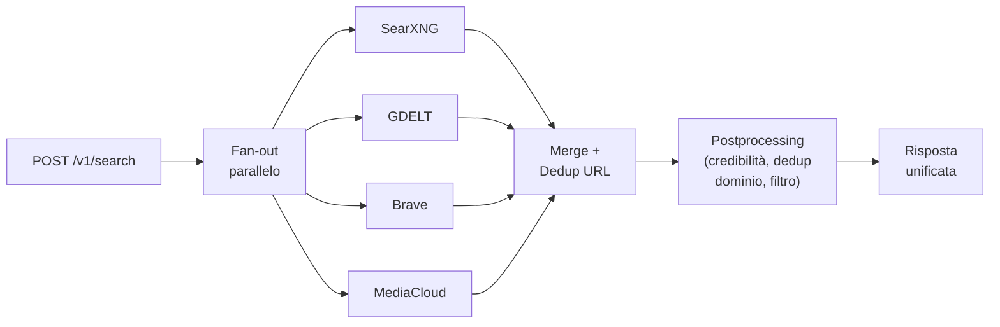

# Backlog — Adverse Media Screening (pilota MASE/FSC)

Aggiornato: 2026-09-07 · Ordine dei componenti: `services/*`, `admin-console/`.

Elenco prioritizzato delle evoluzioni. La pipeline di base è operativa e
collaudata end-to-end (registro Soggetti, web search multi-sintassi con
anti-omonimia a due livelli, Entity Resolution, fetch+mention, FATF, AMI pesato,
SVI mock, alert con evidenze). Questo documento traccia i passi successivi.

## Legenda

- **Priorità** — `P0` bloccante (compliance / pilota non avviabile senza);
  `P1` operativo essenziale; `P2` qualità/copertura/accuratezza.
- **Effort** — `S` (≤ ~2 gg), `M` (~1 settimana), `L` (> 1 settimana), stime
  indicative da raffinare in analisi.

## Quadro sinottico

| ID | Titolo | Priorità | Effort | Componenti principali |
|----|--------|:--------:|:------:|-----------------------|
| B1 | Redazione PII prima dell'LLM | **P0** | M | `llm-gateway`, `worker-scraping` |
| B2 | Payload SVI reali | P1 | M | `svi-publisher` |
| B3 | Observability (metriche/log/tracing) | P1 | M | tutti i servizi, `docker-compose` |
| B4 | Rate limiter distribuito su Redis | P1 | S–M | `search-gateway`, `redis` |
| B5 | Scoring AMI completo | P2 | M | `worker-scraping` |
| B6 | Headless browser (fonti JS) | P2 | M | `worker-scraping` |
| B7 | NER / Embedding per l'anti-omonimia | P2 | L | `entity-resolution`, `worker-scraping` |
| B8 | Multi-provider fan-out ricerca | P2 | M | `search-gateway`, `docker-compose` |

**Sequenza adottata (pilota): B1 → B6 → B7 → B8** — compatibilità verificata sul
codice. B1 parte in versione **MVP regex** (indipendente); dopo B7 va rifinita con
NER (vedi **B1.1**). B6 precede B7 così il NER lavora su testo più ricco
(JS-rendered); B8 per ultimo, quando gli stadi a monte (PII, estrazione,
disambiguazione) sono già solidi e il volume di articoli cresce.

_Sequenza alternativa a priorità pura (compliance+operatività prima):_
B1 → (B2, B3, B4 in parallelo) → B8 → B5 → B6 → B7.

---

## B1 — Redazione PII prima dell'invio all'LLM · P0

**Stato: ✅ FATTO (MVP regex).** Modulo `services/llm-gateway/app/pii.py` +
hook in `foundry.classify` (chokepoint egress), toggle `PII_REDACTION`, audit nel
campo `pii_redaction` della risposta, test `tests/test_pii.py`. Resta **B1.1**
(mascheramento nomi via NER, dopo B7).

**Perché.** È la voce più urgente per la compliance **GDPR / AI Act**. Oggi il
testo degli articoli — che contiene dati personali di **terzi** (non solo il
soggetto) — viene inviato ad Azure AI Foundry per la classificazione FATF
**senza mascheramento**. Minimizzazione (art. 5 GDPR) e trasparenza/DPIA (AI Act)
impongono di ridurre le PII trasmesse a un processore esterno.

**Scope.** Modulo di redazione/pseudonimizzazione che, **prima** della
classificazione, sostituisce con placeholder le PII non necessarie (nominativi di
terzi diversi dal soggetto, indirizzi, CF/P.IVA, email, telefoni, IBAN),
conservando il soggetto-target e il contesto utile alla classificazione.

**Componenti.** Chokepoint unico verso Azure: `services/llm-gateway/app/foundry.py`
(`_classify_one`, unico punto in cui il testo lascia il perimetro). In alternativa
nel worker, tra la costruzione di `combined` e `classify_fatf`
(`services/worker-scraping/workflows.py`) — la verifica di menzione avviene **prima**,
quindi la redazione non rompe il match del soggetto. Nuovo modulo `pii_redaction`.

**Follow-up B1.1 (dopo B7).** Potenziare la redazione con **NER** per mascherare i
**nomi** di terzi non-soggetto: il regex-MVP copre CF/P.IVA, email, telefoni, IBAN
e indirizzi, ma non i nomi arbitrari, che richiedono il riconoscimento entità (B7).

**Definition of Done.**
- il payload verso Azure non contiene PII non-soggetto (test di verifica);
- toggle di configurazione (default: redazione attiva in ambienti non-mock);
- log di **audit** di cosa è stato redatto (categoria, conteggio — non il valore);
- nota DPIA aggiornata.

## B2 — Payload SVI reali · P1

**Perché.** Sblocca l'operatività investigativa: oggi `svi-publisher` gira in
`SVI_MODE=mock`, quindi gli alert restano nella console React e **l'istruttore
non li vede in SVI**.

**Scope.** Publisher reale: mapping `AMI / categorie FATF / evidenze / motivazione`
→ schema SVI; autenticazione all'ambiente; gestione errori con retry;
**idempotenza** (nessun alert duplicato su ripubblicazione).

**Componenti.** `services/svi-publisher`.

**Dipendenze.** Specifica dello schema SVI di destinazione e credenziali
dell'ambiente. `SVI_MODE=mock` resta selezionabile per lo sviluppo locale.

**Definition of Done.** Un alert prodotto dalla pipeline compare in SVI con
evidenze e motivazione; retry e idempotenza verificati; mock invariato in locale.

## B3 — Observability · P1

**Perché.** Senza metriche il sistema è una **scatola nera** operativa: non si
misura carico, latenza, tasso di 429, esiti del gate, distribuzione AMI.

**Scope.**
- **Metriche** (Prometheus): richieste/latenze per servizio, esiti Entity
  Resolution (`resolved/ambiguous/needs_review/…`), esiti ricerca per provider e
  429, distribuzione AMI/risk level, articoli con/senza menzione;
- **Log strutturati** con `correlation-id` propagato lungo il workflow;
- **Health/readiness** uniformi; dashboard base (Grafana);
- (opzionale) **tracing** OpenTelemetry per la catena ER→search→fetch→classify.

**Componenti.** Middleware comune ai servizi (`api`, `search-gateway`,
`entity-resolution`, `worker-scraping`, `llm-gateway`, `svi-publisher`);
`docker-compose.dev.yml` (Prometheus + Grafana).

**Definition of Done.** `/metrics` per servizio; dashboard con i KPI chiave;
correlation-id visibile end-to-end su un caso di esempio.

## B4 — Rate limiter distribuito su Redis · P1

**Perché.** Critico per la scalabilità. Il throttle attuale di GDELT/Brave è
**in-process** (`asyncio.Lock` + variabili globali in `providers.py`): con più
worker/repliche ogni processo ha il proprio contatore, quindi i limiti upstream
(GDELT ~1 req/5s, Brave free ~1 req/s) vengono **superati** → 429.

**Scope.** Rate limiter **distribuito** (token bucket) su Redis, condiviso tra le
repliche, per-provider; sostituisce `_throttle_gdelt` / `_throttle_brave`
mantenendo l'interfaccia.

**Componenti.** `services/search-gateway/app/providers.py`; `redis` (già nello
stack).

**Definition of Done.** Con N repliche del gateway il rate verso ciascun provider
resta sotto soglia (test di concorrenza); nessuna regressione sul singolo worker.

## B5 — Scoring AMI completo · P2

**Perché.** Migliora la pertinenza. L'AMI attuale =
`base(severità FATF) × credibilità × corroborazione` con cap vittima/bystander.
Mancano materialità sul CUP, freschezza e sentiment.

**Scope.**
- **Materialità CUP** — peso in base a ruolo/esposizione del soggetto
  sull'intervento (RUP, esecutore, beneficiario) e pertinenza dell'evidenza al CUP;
- **Freschezza** — decadimento temporale (le notizie recenti pesano di più);
- **Sentiment** — polarità negativa dell'articolo come modulatore.

**Componenti.** `services/worker-scraping/app` (`compute_ami`); il registro
fornisce già ruolo/CUP; il sentiment può appoggiarsi all'`llm-gateway`.

**Definition of Done.** L'AMI incorpora materialità + freschezza (+ sentiment se
abilitato) con **pesi configurabili** e spiegazione nei driver; test su casi noti.

## B6 — Headless browser per fonti JS-rendered · P2

**Stato: ✅ FATTO.** Modulo `render.py` (Playwright/Chromium) + activity
`render_source` instradata nella stessa pipeline snapshot/hash/WARC; il workflow
fa il fallback quando l'estrazione HTTP è < ~400 caratteri e tiene la versione con
più testo. Playwright + Chromium aggiunti all'immagine `worker-scraping`; toggle
`HEADLESS_FALLBACK`. Driver dedicato nell'alert.

**Perché.** Aumenta la copertura: il fetch attuale è HTTP semplice, mentre
~30–40% dei siti moderni rende i contenuti in JavaScript e oggi tornano quasi
vuoti. Un browser headless (**Playwright**) recupera il contenuto renderizzato.

**Scope.** Fallback a Playwright quando l'estrazione semplice trova poco contenuto
(euristica su lunghezza/qualità); pool e timeout; rispetto di robots/UA; controllo
di costo e latenza (usato solo quando serve). **Richiede** l'aggiunta di Playwright
+ browser all'immagine `worker-scraping` (oggi: `temporalio, httpx, trafilatura,
boto3, warcio`; nessun browser incluso), con impatto su dimensione immagine e avvio.

**Componenti.** `services/worker-scraping` (`fetch_source` / `extract_content`).

**Definition of Done.** Un set di URL JS-rendered noti passa da "vuoto" a
"contenuto estratto"; fallback attivato solo quando necessario; limiti di risorsa.

## B7 — NER / Embedding per l'anti-omonimia · P2

**Perché.** Riduce gli alert HITL per omonimia irrisolta. L'Entity Resolution usa
oggi match deterministico (CF/P.IVA) + similarità sul nome normalizzato: i casi
senza identificatore forte finiscono in revisione umana
(`ambiguous`/`needs_review`).

**Scope.**
- **NER** (modello IT) per estrarre persone/organizzazioni dagli articoli →
  corroborazione più robusta dell'attuale `mention.check` (oltre il match di
  stringa su azienda/località/ruolo);
- **Embedding** per similarità semantica di nome/contesto, oltre la similarità di
  stringa in `normalize.py`.

**Componenti.** `services/entity-resolution` (`normalize.py`, `resolver.py`);
`services/worker-scraping/app` (`mention.py`).

**Sinergie.** Alimenta B1 (redazione PII robusta via NER) e B5 (materialità).

**Definition of Done.** Riduzione **misurabile** degli alert HITL su un set di
test, senza aumento dei falsi positivi di attribuzione.

## B8 — Multi-provider fan-out della ricerca · P2

**Perché.** Oggi `SEARCH_PROVIDER` seleziona **un solo** motore per volta. Il
fan-out parallelo su più motori aumenta **recall** (unione degli indici),
**resilienza** (se uno va in 429/timeout gli altri coprono) e **corroborazione**
(lo stesso URL trovato da più motori è un segnale forte). Realizza lo schema
proposto (vedi diagramma) e l'analisi in
[`open_search_engines`](open_search_engines.md).

**Architettura obiettivo.**

**Scope.**
- `SEARCH_PROVIDER` accetta una **lista** (es. `searxng,gdelt,brave,mediacloud`);
- fan-out con `asyncio.gather`, **timeout per provider** e degradazione graziosa
  (se tutti falliscono → `mock`);
- **merge + dedup per URL**, **boost di corroborazione** (URL da 2+ motori sale di
  ranking), **annotazione provider** (`provider: "gdelt+brave"`) per tracciabilità;
- **postprocessing invariato** (credibilità testata, dedup per dominio, filtro);
- ogni provider mantiene la **propria sintassi** di query (`boolean` per GDELT,
  `plain` per Brave/SearXNG) — già gestita da `build_query_variants(..., syntax=)`.

**Motori prioritari** (dall'analisi allegata):
- **SearXNG** — meta-search self-hosted (Google/Bing/DuckDuckGo News…), primario:
  niente chiave, niente rate-limit upstream centralizzato, container ufficiale;
- **MediaCloud** — news con metadati ricchi e filtri IT/testata (allineato al caso
  adverse media);
- poi, come arricchimento/diversificazione: **Newscatcher**, **Mojeek** (indice
  indipendente), **Marginalia** (siti istituzionali di nicchia), **Common Crawl**
  (retrospettivo, non real-time).

**Componenti.** `services/search-gateway/app/providers.py` (`search()`),
`app/config.py`, `docker-compose.dev.yml` (servizio `searxng`).

**Definition of Done.** Query con 2+ provider in parallelo; risultati fusi e
dedotti per URL; corroborazione riflessa nel ranking; il singolo-provider resta
supportato per compatibilità.
