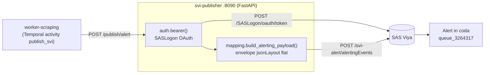

# `svi-publisher` — configurazione e integrazione con SAS Visual Investigator (as-built)

Riferimento **autorevole e aggiornato** del microservizio `svi-publisher` e della sua
integrazione **live** con SAS Visual Investigator (SVI) su SAS Viya. Riflette il
comportamento reale del codice e dell'ambiente (demo RACE `azureuse030088.race.sas.com`).

**Stato: LIVE end-to-end funzionante.** Screening reale → alert in coda SVI, con
motivazione (`alertTriggerText`), enrichment strutturato (`enrichmentJson`) ed etichetta
= denominazione del soggetto.

**Vedi anche** (documenti collegati, ciascuno per il suo ambito):
- [`SVI_GOLIVE.md`](SVI_GOLIVE.md) — runbook: come ottenere il token e attivare il live.
- [`SVI_DOMAIN_ADVERSE_MEDIA.md`](SVI_DOMAIN_ADVERSE_MEDIA.md) — setup **lato SVI** (dominio/coda).
- [`SVI_ENRICHMENT_FIELDS.md`](SVI_ENRICHMENT_FIELDS.md) — **visualizzare** l'enrichment (Page Builder).
- [`SVI_LIVE_STATUS.md`](SVI_LIVE_STATUS.md) — storico as-built, valori d'ambiente, troubleshooting.

---

## 1. Ruolo e architettura

`svi-publisher` è l'**anti-corruption layer** verso SVI: incapsula tutta la conoscenza
specifica di SAS VI (auth, endpoint, formato payload). Se l'API SVI cambia, cambia **solo**
questo servizio. Espone un'API HTTP interna che il worker chiama a fine screening.



- **mock** (default locale): nessuna Viya, restituisce id fittizi `svi-mock-…`.
- **live**: OAuth SASLogon → (opz. entità Data Hub) → alert via *alerting event*.

File del servizio (`services/svi-publisher/`):

| File | Ruolo |
|---|---|
| `app/main.py` | API FastAPI (`/healthz`, `/publish/alert`), logging applicativo |
| `app/config.py` | configurazione (pydantic-settings, tutte le `SVI_*/SAS_*/VIYA_*`) |
| `app/auth.py` | token SASLogon (OAuth) — costruzione richiesta pura + cache |
| `app/mapping.py` | **anti-corruption puro**: alert interno → envelope SVI (no I/O) |
| `app/svi_client.py` | pubblicazione (mock/live), retry+backoff, idempotenza |
| `scripts/svi_smoketest.py` | smoke-test live: auth + discovery + `--create`/`--diagnose` |
| `scripts/svi_admin.py` | discovery amministrativa (domini/strategie/code) |
| `scripts/svi_metadata.py` | ispezione metadati/alert (grafo API, dump alert) |
| `tests/` | test unitari (mapping 7/7, idempotenza 5/5) |

---

## 2. API del servizio

Container: `uvicorn app.main:app` su **porta 8090**. Chiamato dal worker via
`SVI_PUBLISHER_URL` (default `http://svi-publisher:8090`).

### `GET /healthz`
Ritorna lo stato e la modalità effettiva — **utile a verificare che il servizio sia in
`live`** e con quale auth:
```json
{ "status": "ok", "mode": "live", "auth": "oauth" }
```

### `POST /publish/alert`
Riceve l'alert canonico dello screening (`AlertIn`) e pubblica in SVI.

**Input** (`AlertIn`):

| Campo | Tipo | Note |
|---|---|---|
| `subject` | str (**obbligatorio**) | denominazione → `actionableEntityLabel` |
| `tipo_soggetto` | str? | persona_fisica / _giuridica |
| `cf_piva` | str? | CF/P.IVA → `actionableEntityId` (fallback: business key) |
| `cup` | str[] | codici CUP |
| `ami_score` | int (**obbligatorio**) | → `score` dell'alert |
| `risk_level` | str (**obbligatorio**) | ALTO/MEDIO/BASSO → enrichment |
| `fatf_categories` | str[] | categorie FATF → enrichment + trigger text |
| `drivers` | str[] | driver dell'AMI → `alertTriggerText` (motivazione) |
| `disposition` | str | default `ESCALATION_I_LIVELLO` |
| `screening_id` | str? | **business key** dell'idempotenza |
| `evidence` | obj[] | url/testata/title/data/snippet/content_hash/… |

**Output** (`PublishOut`): `{ svi_alert_id, mode, deduplicated, document_id }`.
Un `svi_alert_id` che inizia con `svi-mock-` = servizio in mock; `deduplicated: true` =
screening già pubblicato (nessun nuovo alert).

---

## 3. Flusso di pubblicazione (modalità `live`)

`svi_client.publish_alert(alert)` (in `app/svi_client.py`):

1. **Idempotenza in-process**: se la `business_key` è in cache (TTL `SVI_IDEMPOTENCY_TTL`),
   ritorna l'id salvato con `deduplicated: true` (nessuna chiamata a SVI).
2. **Auth**: `auth.bearer(client)` → token SASLogon (cache con margine 30 s).
3. **(Opzionale) Entità Data Hub**: se `SVI_LOAD_ENTITY=true`, `POST /svi-datahub/documents`.
   **Non bloccante**: un errore (es. `400 DH5104`) logga un warning e prosegue con l'alert.
4. **Alert**: `POST {alerts_base}/alertingEvents` con l'**envelope** (§4) e il media type
   versionato. `_retry` gestisce il backoff sugli errori transitori.
5. **Esito**: risposta `2xx` → alert creato. **`500 errorCode 1008`** ("data error") è
   **ambiguo** — duplicato **oppure** riferimento non valido (dominio/coda/entityType/
   alertTypeCode assenti nell'ambiente): di **default** viene **sollevato** come errore
   (l'alert NON è creato; non lo si maschera da successo) e non ritentato. Con
   `SVI_DEDUP_ON_1008=true` lo si tratta come duplicato idempotente (`deduplicated: true`).
6. **id**: `alertId` dalla risposta, o (fallback) l'`alertingEventId` deterministico.

### Idempotenza (design)
- `business_key(alert)` = `ams-<screening_id>`; in mancanza, `ams-<sha256(canonico)[:16]>`.
- `alertingEventId` = `uuid5(NS, business_key)` → **deterministico**: stesso screening →
  stesso id. La dedup **primaria** è la cache in-process (prima della POST). Il 1008 lato
  SVI **non** è una dedup affidabile (è ambiguo col config error) → di default solleva;
  `SVI_DEDUP_ON_1008=true` lo riattiva dove i riferimenti sono validi.

### Robustezza (retry)
`_retry` ritenta su **429/500/502/503/504** con backoff `SVI_RETRY_BACKOFF × 2^tentativo`
(1.5, 3.0, 6.0 s…), **tranne** il data-error **1008** (mai transitorio) e i **4xx**
(terminali, propagati subito).

### Osservabilità
Log applicativi visibili sotto uvicorn (handler dedicato in `main.py`):
```
INFO:svi_publisher:SVI publish live: key=… eventId=… entity=… score=… type=… queue=… sezioni=[…]
INFO:svi_publisher:Alerting event SVI CREATO|DUPLICATO: alert=… http=… dedup=…
```
Lato worker: `SVI publish: id=… mode=… dedup=… screening=…`.

---

## 4. Mappatura alert → payload SVI (envelope "flat")

L'alert si crea con un **alerting event** (`POST /svi-alert/alertingEvents`), **non** con
`POST /svi-alert/alerts` (sola lettura). Il body è un **envelope** con discriminatore
`jsonLayout:"flat"` e sezioni ad **array** (struttura confermata dall'SVI Admin: la sua
assenza causava il generico `500 tdc.bad.request`).

Media type (obbligatorio, versionato):
`application/vnd.sas.investigation.triage.alerting.data.flat+json;version=1`

```json
{
  "jsonLayout": "flat",
  "alertingEvents": [
    {
      "alertingEventId": "<uuid5(businessKey)>",
      "actionableEntityType": "Soggetto",
      "actionableEntityId": "00743110157",
      "actionableEntityLabel": "ACME Costruzioni S.r.l.",
      "score": 82,
      "alertTypeCode": "strategy_default",
      "recommendedQueueId": "queue_3264317",
      "alertTriggerText": "Categorie FATF: … • Motivazione: … • AMI = …",
      "alertOriginCode": "adverse_media"
    }
  ],
  "enrichment": [
    { "alertingEventId": "…", "risk_level": "ALTO",
      "fatf_categories": "Corruption & Bribery; Money Laundering",
      "rationale": "…", "disposition": "ESCALATION_I_LIVELLO",
      "ami_score": "82", "source": "adverse-media-screening" }
  ]
}
```

### Oggetto `alertingEvent` (campi)

| Campo | Origine | Note |
|---|---|---|
| `alertingEventId` | `uuid5(businessKey)` | deterministico → idempotenza |
| `actionableEntityType` | `SVI_ENTITY_TYPE` | es. `Soggetto` |
| `actionableEntityId` | `cf_piva` \| business key | id dell'entità azionabile |
| `actionableEntityLabel` | `subject` (fallback: id) | **nome leggibile in coda** |
| `score` | `ami_score` | è l'AMI mostrato come score core |
| `alertTypeCode` | `SVI_ALERT_TYPE_CODE` | **obbligatorio** (senza → 1008) |
| `recommendedQueueId` | `SVI_QUEUE` | opzionale ma consigliato (routing) |
| `alertTriggerText` | `drivers` (motivazione) | **mostrato di default**: FATF, ruolo, calcolo AMI |
| `alertOriginCode` | `SVI_ALERT_ORIGIN` | omesso se vuoto |

> **Nota**: l'envelope **non** porta `domainId` (implicito nella coda/strategia).

### Sezioni opzionali (gated da config, off di default)
- **`enrichment[]`** (`SVI_SEND_ENRICHMENT`): AMI/risk/FATF/disposition/motivazione, ogni
  riga legata all'evento via `alertingEventId`. **Viene memorizzato sull'alert nel campo
  `enrichmentJson`** (verificato). La sua **visualizzazione** è configurazione di pagina —
  vedi [`SVI_ENRICHMENT_FIELDS.md`](SVI_ENRICHMENT_FIELDS.md). Le chiavi sono rimappabili
  (`SVI_ENRICH_KEY_*`) ai nomi attributo del dominio.
- **`scenarioFiredEvents[]`** (`SVI_SEND_SCENARIO_EVENTS`): una riga per categoria FATF
  (findings: `scenarioId`/`scenarioName`/`score`/`messageTemplateText`).
- **`contributingObjects[]`** (`SVI_SEND_CONTRIBUTING_OBJECTS`): le evidenze (articoli/fonti).

Codice: `mapping.build_alerting_payload()` (funzione **pura**, testabile senza rete).

---

## 5. Autenticazione (SASLogon)

`SVI_AUTH_MODE`:

| Modo | Come | Uso |
|---|---|---|
| `oauth` (default) | `POST {viya}/SASLogon/oauth/token`, client via **HTTP Basic** (`client_id:client_secret`), grant `client_credentials` o `password` | pilota/produzione |
| `token` | bearer già ottenuto in `SAS_BEARER_TOKEN` (es. da `sas-viya auth` o browser) | test rapido; il token **scade** |
| `broker` | `GET` a un sidecar (`SAS_TOKEN_BROKER_URL`) che restituisce un token di servizio | integrazioni enterprise |

Il token è messo in **cache** fino a 30 s prima della scadenza. La costruzione della
richiesta OAuth è isolata in `auth.build_oauth_request()` (pura → testabile).

- **Demo RACE**: client integrato **`sas.ec`** (secret vuoto) + grant **`password`** (auth
  locale). Semplice ma legato a credenziali utente.
- **Produzione**: registrare un client dedicato e usare **`client_credentials`** (vedi
  [`SVI_GOLIVE.md`](SVI_GOLIVE.md), passo 1C).

---

## 6. Riferimento configurazione (`.env`)

Tutte le variabili (da `app/config.py`). **Segreti solo in `.env`, mai nel repo.** In
`docker-compose.dev.yml` il servizio usa `env_file: .env` (nessun override: `SVI_MODE`
arriva dal `.env`, default `mock`).

### Modalità ed endpoint
| Variabile | Default | Significato |
|---|---|---|
| `SVI_MODE` | `mock` | `live` per pubblicare davvero |
| `VIYA_ENDPOINT` | — | es. `https://azureuse030088.race.sas.com` |
| `SVI_DATAHUB_BASE` | `{viya}/svi-datahub` | override base URL (raro) |
| `SVI_ALERTS_BASE` | `{viya}/svi-alert` | override base URL (raro) |

### Autenticazione
| Variabile | Default | Significato |
|---|---|---|
| `SVI_AUTH_MODE` | `oauth` | `oauth` / `token` / `broker` |
| `SAS_OAUTH_GRANT` | `client_credentials` | oppure `password` |
| `SAS_CLIENT_ID` / `SAS_CLIENT_SECRET` | — | client OAuth (**segreti**) |
| `SAS_USERNAME` / `SAS_PASSWORD` | — | solo grant `password` (**segreti**) |
| `SAS_OAUTH_SCOPE` | — | opzionale |
| `SAS_BEARER_TOKEN` | — | solo `SVI_AUTH_MODE=token` (**segreto**) |
| `SAS_TOKEN_BROKER_URL` | `http://sas-token-broker:8099/token` | solo `broker` |

### Modello alert
| Variabile | Default | Significato |
|---|---|---|
| `SVI_ENTITY_TYPE` | `Soggetto` | `actionableEntityType` |
| `SVI_QUEUE` | — | `recommendedQueueId` (coda con `acceptManualAlerts=true`) |
| `SVI_ALERT_TYPE_CODE` | `strategy_default` | **obbligatorio** lato SVI |
| `SVI_ALERT_ORIGIN` | — | `alertOriginCode` (vuoto = omesso) |
| `SVI_DOMAIN_ID` | — | **informativo** (il dominio è implicito nella coda) |

### Sezioni enrichment e chiavi
| Variabile | Default | Significato |
|---|---|---|
| `SVI_SEND_ENRICHMENT` | `false` | includi `enrichment[]` |
| `SVI_SEND_SCENARIO_EVENTS` | `false` | includi `scenarioFiredEvents[]` |
| `SVI_SEND_CONTRIBUTING_OBJECTS` | `false` | includi `contributingObjects[]` |
| `SVI_ENRICH_KEY_AMI` | `ami_score` | nome chiave enrichment |
| `SVI_ENRICH_KEY_RISK` | `risk_level` | " |
| `SVI_ENRICH_KEY_FATF` | `fatf_categories` | " |
| `SVI_ENRICH_KEY_DISPOSITION` | `disposition` | " |
| `SVI_ENRICH_KEY_RATIONALE` | `rationale` | " |
| `SVI_ENRICH_KEY_SOURCE` | `source` | " |
| `SVI_ENRICH_KEY_RATIONALE_SUMMARY` | `rationale_sintesi` | sintesi motivazione (breve, per la griglia) |
| `SVI_ENRICH_KEY_SOURCES` | `fonti` | link fonti/evidenze (`testata: url` per riga) |
| `SVI_RATIONALE_SUMMARY_LEN` | `300` | lunghezza max della sintesi |
| `SVI_LOAD_ENTITY` | `false` | carica il documento Data Hub prima dell'alert (non bloccante) |
| `SVI_DEDUP_ON_1008` | `false` | tratta `errorCode 1008` come duplicato idempotente invece di sollevarlo — solo su ambienti a riferimenti validi |

### Robustezza e TLS
| Variabile | Default | Significato |
|---|---|---|
| `SVI_REQUEST_TIMEOUT` | `30.0` | timeout HTTP (s) |
| `SVI_MAX_RETRIES` | `3` | tentativi sugli errori transitori |
| `SVI_RETRY_BACKOFF` | `1.5` | base backoff (× 2^tentativo) |
| `SVI_IDEMPOTENCY_TTL` | `86400` | TTL cache business_key → id (s) |
| `SVI_VERIFY_TLS` | `true` | verifica cert Viya; `false` **solo** demo self-signed |
| `SVI_CA_BUNDLE` | — | path al certificato/CA (verifica attiva, meglio di `false`) |

---

## 7. Valori dell'ambiente demo (RACE)

Configurazione **funzionante** verificata (segreti redatti):

```dotenv
SVI_MODE=live
VIYA_ENDPOINT=https://azureuse030088.race.sas.com
SVI_AUTH_MODE=oauth
SAS_OAUTH_GRANT=password
SAS_CLIENT_ID=sas.ec
SAS_CLIENT_SECRET=
SAS_USERNAME=<utente demo>
SAS_PASSWORD=<password>
SVI_VERIFY_TLS=false            # solo demo self-signed
SVI_ENTITY_TYPE=Soggetto
SVI_QUEUE=queue_3264317
SVI_ALERT_TYPE_CODE=strategy_default
SVI_ALERT_ORIGIN=adverse_media
SVI_SEND_ENRICHMENT=true
SVI_LOAD_ENTITY=false           # l'entità NON è richiesta per creare l'alert
```

Oggetti nell'ambiente: **dominio** `d_42843825` ("Adverse Media"), **strategia**
`strategy_36821163` (attiva), **coda** `queue_3264317` (accetta alert manuali),
**entity type** `Soggetto`.

---

## 8. Operazioni e diagnosi

Tutti gli script si eseguono **dalla macchina che raggiunge Viya** (riusano auth/TLS dal
`.env`) e non stampano mai segreti:

```powershell
$svi = "docker compose -f docker-compose.dev.yml run --build --rm svi-publisher python"

# Smoke-test live: auth + discovery + payload
& $svi scripts/svi_smoketest.py                 # dry-run (stampa l'envelope)
& $svi scripts/svi_smoketest.py --create --unique   # crea un alert di prova (id nuovo)
& $svi scripts/svi_smoketest.py --diagnose      # isola il campo che causa un errore

# Discovery amministrativa / ispezione
& $svi scripts/svi_admin.py                     # domini/strategie/code
& $svi scripts/svi_metadata.py                  # grafo API + dump di un alert reale

# Healthcheck del servizio in esecuzione
curl http://localhost:8090/healthz              # atteso: {"mode":"live",...}
```

Test unitari (offline, pure functions):
```bash
python services/svi-publisher/tests/test_mapping.py       # 7/7
python services/svi-publisher/tests/test_idempotency.py   # 5/5
```

---

## 9. Troubleshooting (catalogo errori)

| Sintomo | Causa | Rimedio |
|---|---|---|
| `500 tdc.bad.request` (anche a body vuoto) | manca l'**envelope** (`jsonLayout`/array) | usare `build_alerting_payload` (già a posto) |
| `500 errorCode 1008` ("data error") | **ambiguo**: `alertTypeCode` mancante/non valido, oppure dominio/coda/entityType **inesistenti in questo ambiente** (tipico dopo un cambio ambiente), oppure `alertingEventId` **duplicato** | di default il publisher **solleva** (alert NON creato). Ricontrolla i valori del **nuovo** ambiente (`svi_smoketest.py --diagnose`, `svi_inspect.py`) nel `.env`. Solo se è un vero duplicato su ambiente valido → `SVI_DEDUP_ON_1008=true` |
| `400` su `/svi-datahub/documents` (DH5104) | `SVI_LOAD_ENTITY=true`, schema doc non allineato | `SVI_LOAD_ENTITY=false` (l'entità non serve) |
| `415 unsupported media type` | manca `+json;version=1` | media type versionato (già default) |
| `405` su `POST /svi-alert/alerts` | gli alert non si creano lì | usare `/svi-alert/alertingEvents` (già a posto) |
| `svi_alert_id` = `svi-mock-…` | servizio in **mock** | `SVI_MODE=live` nel `.env` + ricreare il container |
| smoke-test **crea** l'alert ma lo **screening reale no** | il servizio `up -d` tiene l'env di quando è partito; lo smoke (`run`) legge il `.env` fresco | ricreare il servizio: `docker compose up -d --force-recreate --build svi-publisher` (+ worker); conferma nel log `SVI publish live: … queue=…` |
| **un solo** campo enrichment non si vede (es. FATF), gli altri sì | chiave inviata ≠ binding griglia `enrichmentJson.<chiave>` byte-per-byte (spesso una **maiuscola**) | allineare stessa grafia su **entrambe** (`SVI_ENRICH_KEY_*` e Field Name griglia), poi salva/deploya la strategia; `enrichmentJson` scritto alla creazione → può servire un alert nuovo |
| `CERTIFICATE_VERIFY_FAILED` | cert self-signed | `SVI_VERIFY_TLS=false` (demo) o `SVI_CA_BUNDLE` |
| `SSL: UNEXPECTED_EOF_WHILE_READING` | connessione chiusa **durante l'handshake TLS** (non è il cert) — tipico dopo un cambio ambiente | `SVI_VERIFY_TLS=false` NON aiuta. Verifica `VIYA_ENDPOINT` (https, host/porta, no path/spazi), raggiungibilità/VPN, `env\|grep -i proxy`, eventuale mTLS/versione TLS. Diagnosi: `curl -vk https://<host>/SASLogon/oauth/token`, `openssl s_client -connect <host>:443 -servername <host>` |
| enrichment non visibile (AMI sì) | è memorizzato in `enrichmentJson` | **visualizzazione**: Page Builder ([`SVI_ENRICHMENT_FIELDS.md`](SVI_ENRICHMENT_FIELDS.md)) |
| alert con label = hash `ams-…` | soggetto senza CF/P.IVA | ora `actionableEntityLabel` = denominazione (nuovi alert) |

> L'egress dalla sessione Claude verso `*.race.sas.com` è **bloccato dalla policy di rete**:
> tutte le chiamate live si eseguono e verificano dalla macchina che raggiunge Viya.

---

## 10. Sicurezza e produzione

- **Segreti** (`SAS_*`, token) **solo** in `.env`, mai committati; `.env` è git-ignored.
- **TLS**: in produzione riattivare la verifica (`SVI_CA_BUNDLE` col certificato del server)
  invece di `SVI_VERIFY_TLS=false`.
- **Auth**: passare dal grant `password`/`sas.ec` (demo) a un **client registrato** con
  `client_credentials` (vedi [`SVI_GOLIVE.md`](SVI_GOLIVE.md)).
- **Idempotenza**: in produzione valutare una cache condivisa (Redis/outbox) al posto di
  quella in-process, per dedup cross-restart e multi-replica.
