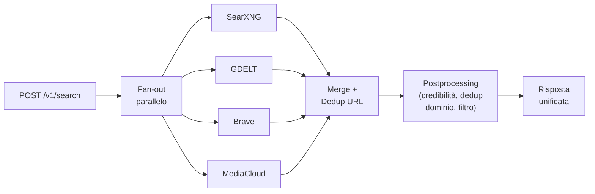

# Motori di Web Search Open — Analisi e Multi-Provider

## Situazione attuale

Il [search-gateway](../services/search-gateway/app/providers.py) supporta **un solo provider alla volta**, selezionato dalla variabile `SEARCH_PROVIDER`:

| Provider | Tipo | Costo | Limiti |
|----------|------|-------|--------|
| `mock` | Fixture locali | Gratis | Nessun dato reale |
| `gdelt` | GDELT DOC 2.0 API | **Keyless** (gratis) | ~1 req/5s per IP, instabile, solo news |
| `brave` | Brave Search API | Freemium (2.000 req/mese gratis) | Affidabile ma a chiave, quota limitata |

L'architettura è già predisposta per l'aggiunta: ogni provider implementa la stessa firma `(subject, mode, max_results, lang, timespan) → (risultati, query, note)` e il postprocessing (credibilità, dedup, filtro) è indipendente dal provider.

---

## Provider Open consigliati

### 1. 🏆 SearXNG (Self-hosted Meta-Search)

| Caratteristica | Dettaglio |
|---|---|
| **Tipo** | Meta-motore open source (aggrega Google, Bing, DuckDuckGo, Wikipedia, ecc.) |
| **Licenza** | AGPL-3.0 |
| **Costo** | Gratis (self-hosted) |
| **API** | REST JSON nativa (`/search?q=...&format=json`) |
| **Deploy** | Container Docker ufficiale (`searxng/searxng`) |
| **Rate limit** | Nessuno intrinseco (limitato dai motori upstream) |
| **Copertura** | Molto ampia: aggrega 70+ motori (web, news, immagini, mappe) |

**Perché è il più consigliato**: girando nel vostro Docker Compose, non avete dipendenze esterne, nessun costo, nessuna API key, e la copertura è enorme perché aggrega i risultati di decine di motori. Si può configurare per cercare solo su motori news (Google News, Bing News, Yahoo News) o su motori web generalisti.

> [!TIP]
> SearXNG è ideale come **provider primario** in sostituzione/affiancamento di GDELT: elimina il rate-limiting e la dipendenza da un singolo motore.

**Configurazione esempio** (nel docker-compose):
```yaml
searxng:
  image: searxng/searxng:latest
  volumes:
    - ./services/search-gateway/searxng-settings.yml:/etc/searxng/settings.yml
  ports: ["8888:8080"]
```

---

### 2. Mojeek API

| Caratteristica | Dettaglio |
|---|---|
| **Tipo** | Motore di ricerca indipendente con **indice proprietario** (non aggrega) |
| **Costo** | Free tier: 1.000 req/mese; piani a pagamento da £6/mese |
| **API** | REST JSON (`api.mojeek.com/search?q=...&fmt=json`) |
| **API Key** | Sì (gratuita per il free tier) |
| **Copertura** | Buona su contenuti europei/anglofoni; indice indipendente da Google |
| **Punto di forza** | Privacy-first, nessun tracking, indice crawler-based autonomo |

**Vantaggio specifico**: essendo un indice completamente indipendente da Google/Bing, i risultati non si sovrappongono a quelli di SearXNG → massima diversificazione.

---

### 3. Marginalia Search

| Caratteristica | Dettaglio |
|---|---|
| **Tipo** | Motore open source specializzato in contenuti testuali / siti non commerciali |
| **Licenza** | AGPL-3.0 |
| **Costo** | Gratis (API pubblica o self-hosted) |
| **API** | REST JSON (`api.marginalia.nu/public/search/...`) |
| **Rate limit** | Non documentato (API pubblica, best-effort) |
| **Copertura** | Nicchia: privilegia blog, siti istituzionali, contenuti editoriali lunghi |

**Vantaggio specifico**: scopre contenuti su siti piccoli/istituzionali che Google e GDELT non indicizzano (es. delibere comunali, atti giudiziari pubblicati su siti di tribunali).

---

### 4. Common Crawl Index

| Caratteristica | Dettaglio |
|---|---|
| **Tipo** | Indice di crawl web su scala petabyte (archivio, non real-time) |
| **Licenza** | Open data |
| **Costo** | Gratis (API pubblica o accesso S3) |
| **API** | REST JSON (`index.commoncrawl.org/CC-MAIN-*/cdx-server?url=...`) |
| **Copertura** | Enorma (miliardi di pagine), ma **non in tempo reale** (crawl mensili) |
| **Latenza** | Alta (secondi) |

**Vantaggio specifico**: utile per **ricerche retrospettive** — trovare articoli che sono stati cancellati o modificati dopo la pubblicazione. Complementare ai motori real-time.

> [!WARNING]
> Non adatto come provider primario: l'indice è aggiornato mensilmente. Ideale come fonte di arricchimento per lo storico.

---

### 5. MediaCloud

| Caratteristica | Dettaglio |
|---|---|
| **Tipo** | Piattaforma open source per analisi media (news monitoring accademico) |
| **Licenza** | MIT |
| **Costo** | Gratis (registrazione richiesta) |
| **API** | REST JSON (ricerca per keyword + filtri temporali/geografici/per testata) |
| **Copertura** | Focus news: monitora decine di migliaia di testate globali |
| **Punto di forza** | Metadati ricchi (testata, paese, lingua, data), filtri geografici |

**Vantaggio specifico**: nato per il monitoraggio mediatico accademico — perfettamente allineato al caso d'uso adverse media. Filtri per paese (Italia) e per testata molto granulari.

---

### 6. Newscatcher API

| Caratteristica | Dettaglio |
|---|---|
| **Tipo** | API specializzata in news aggregation |
| **Costo** | Free tier: 1.000 req/mese; piani premium |
| **API** | REST JSON (`/v2/search?q=...&lang=it&countries=IT`) |
| **API Key** | Sì (gratuita) |
| **Copertura** | 60.000+ fonti news globali, ottimo filtro per lingua/paese |
| **Punto di forza** | Specializzato in news, metadati puliti, snippet già estratti |

**Vantaggio specifico**: il free tier è sufficiente per il pilota. Filtro nativo per lingua italiana e paese Italia. I risultati includono già titolo, snippet, autore, data.

---

### 7. Wiby.me

| Caratteristica | Dettaglio |
|---|---|
| **Tipo** | Motore open source per il "vecchio web" (siti leggeri, non commerciali) |
| **Licenza** | Open source |
| **Costo** | Gratis |
| **API** | REST JSON (`wiby.me/json/?q=...`) |
| **Copertura** | Molto limitata (nicchia vintage/alternativa) |

**Vantaggio specifico**: marginale per adverse media, ma può scoprire contenuti su siti istituzionali molto semplici non indicizzati altrove.

---

## Confronto riepilogativo

| Provider | Copertura News IT | Costo | Self-hosted | Real-time | Consigliato per |
|:---|:---:|:---:|:---:|:---:|:---|
| **SearXNG** | ⭐⭐⭐⭐⭐ | Gratis | ✅ | ✅ | Provider primario (meta-search) |
| **GDELT** *(attuale)* | ⭐⭐⭐⭐ | Gratis | ❌ | ✅ | News globali, copertura storica |
| **Brave** *(attuale)* | ⭐⭐⭐ | Freemium | ❌ | ✅ | Fallback affidabile |
| **MediaCloud** | ⭐⭐⭐⭐ | Gratis | ❌ | ✅ | Monitoraggio mediatico accademico |
| **Newscatcher** | ⭐⭐⭐⭐ | Freemium | ❌ | ✅ | News aggregate con metadati puliti |
| **Mojeek** | ⭐⭐ | Freemium | ❌ | ✅ | Indice indipendente, diversificazione |
| **Common Crawl** | ⭐⭐⭐ | Gratis | ❌ | ❌ | Ricerche retrospettive / storico |
| **Marginalia** | ⭐⭐ | Gratis | ✅ | ✅ | Siti istituzionali di nicchia |

---

## Sì, si possono configurare contemporaneamente

L'architettura attuale usa un **singolo provider** (`SEARCH_PROVIDER=mock|gdelt|brave`). Tuttavia il codice è già predisposto per l'estensione: basta modificare la funzione [search()](../services/search-gateway/app/providers.py) per supportare una modalità **multi-provider con fan-out parallelo**.

### Architettura multi-provider proposta



### Come funzionerebbe

1. **Configurazione**: la variabile `SEARCH_PROVIDER` accetterebbe una lista separata da virgola:
   ```env
   SEARCH_PROVIDER=searxng,gdelt,brave
   ```

2. **Fan-out parallelo**: `asyncio.gather()` lancia tutte le ricerche contemporaneamente. Ogni provider ha un timeout indipendente; se uno fallisce, gli altri continuano.

3. **Merge intelligente**: i risultati vengono unificati con:
   - **Dedup per URL** (lo stesso articolo trovato da 2 provider non appare due volte)
   - **Boost di corroborazione**: se lo stesso URL è restituito da 2+ provider, il suo ranking sale (conferma indipendente)
   - **Annotazione provider** (`provider: "gdelt+brave"`) per tracciabilità

4. **Postprocessing invariato**: il postprocessing esistente (credibilità testata, dedup per dominio, filtro soglia) si applica identicamente ai risultati fusi.

5. **Fallback chain**: se un provider è temporaneamente non disponibile (429, timeout), gli altri coprono. Se tutti falliscono, si attiva il mock.

### Vantaggi del multi-provider simultaneo

| Aspetto | Singolo provider (oggi) | Multi-provider |
|---------|------------------------|----------------|
| **Recall** | Dipende dalla copertura di un solo motore | Unione degli indici → copertura massima |
| **Resilienza** | Se GDELT va in 429, la ricerca fallisce | Se uno fallisce, gli altri coprono |
| **Corroborazione** | Non verificabile | Se 3 motori trovano lo stesso articolo, è un segnale forte |
| **Diversificazione fonti** | Un motore può avere bias sistematici | Più motori riducono il bias di indicizzazione |
| **Latenza** | Seriale (un solo provider) | Parallela — il tempo totale è quello del più lento |

### Configurazione consigliata per il pilota

```env
# Provider simultanei (fan-out parallelo)
SEARCH_PROVIDER=searxng,gdelt

# SearXNG locale (nel docker-compose)
SEARXNG_URL=http://searxng:8080

# GDELT come backup / corroborazione
GDELT_ENDPOINT=https://api.gdeltproject.org/api/v2/doc/doc
```

> [!TIP]
> **Raccomandazione**: partire con **SearXNG + GDELT** in parallelo. SearXNG copre il recall ampio (meta-search su Google/Bing/DuckDuckGo News), GDELT aggiunge la profondità storica news. Se serve un terzo livello di affidabilità, aggiungere **Brave** o **Newscatcher**.
